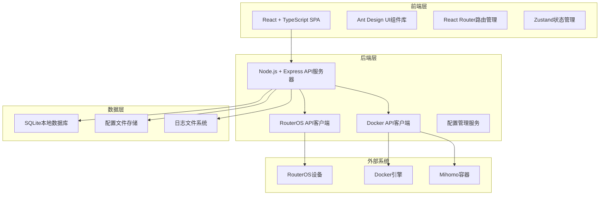
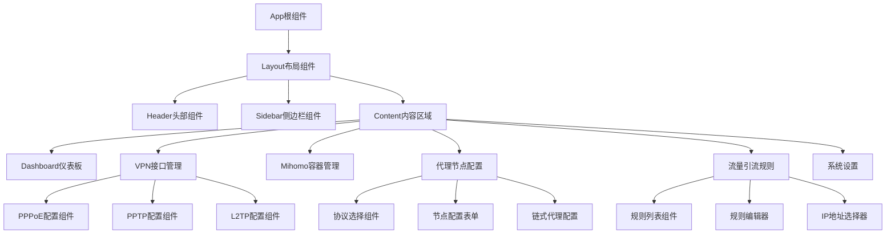

# 设计文档

## 概述

RouterOS中文Web管理界面是一个基于现代Web技术栈的单页应用程序（SPA），采用React + TypeScript前端和Node.js后端架构。系统通过RouterOS API与路由器设备通信，提供直观的中文界面来管理VPN接口、mihomo代理容器和流量引流规则。

## 架构

### 系统架构图



### 技术栈选择

**前端技术栈:**
- React 18 + TypeScript - 现代化组件开发
- Ant Design - 企业级UI组件库，支持中文
- React Router v6 - 客户端路由管理
- Zustand - 轻量级状态管理
- Axios - HTTP客户端
- React Query - 服务端状态管理和缓存

**后端技术栈:**
- Node.js + Express - 轻量级API服务器
- TypeScript - 类型安全的服务端开发
- node-routeros - RouterOS API客户端库
- dockerode - Docker API客户端
- SQLite3 - 轻量级本地数据库
- Winston - 日志管理

## 组件和接口

### 前端组件架构



### 核心接口定义

**VPN接口配置接口:**
```typescript
interface VPNInterface {
  id: string;
  name: string;
  type: 'pppoe' | 'pptp' | 'l2tp';
  enabled: boolean;
  config: PPPoEConfig | PPTPConfig | L2TPConfig;
  status: 'connected' | 'disconnected' | 'connecting' | 'error';
  createdAt: Date;
  updatedAt: Date;
}

interface PPPoEConfig {
  username: string;
  password: string;
  serviceName?: string;
  interface: string;
  dialOnDemand: boolean;
}

interface PPTPConfig {
  server: string;
  username: string;
  password: string;
  encryption: 'none' | 'require' | 'maximum';
  authentication: string[];
}

interface L2TPConfig {
  server: string;
  username: string;
  password: string;
  ipsecSecret: string;
  useIPSec: boolean;
}
```

**代理节点配置接口:**
```typescript
interface ProxyNode {
  id: string;
  name: string;
  protocol: ProxyProtocol;
  config: ProxyConfig;
  chainProxy?: string; // 前置代理节点ID
  enabled: boolean;
  testResult?: ConnectionTestResult;
  createdAt: Date;
  updatedAt: Date;
}

type ProxyProtocol = 'vless' | 'vmess' | 'trojan' | 'grpc' | 'anytls' | 'ss' | 'socks5';

interface VlessConfig {
  server: string;
  port: number;
  uuid: string;
  encryption: string;
  transport: TransportConfig;
  tls?: TLSConfig;
}

interface VMessConfig {
  server: string;
  port: number;
  uuid: string;
  alterId: number;
  cipher: string;
  network: 'tcp' | 'ws' | 'grpc';
  networkSettings?: NetworkSettings;
}

interface TrojanConfig {
  server: string;
  port: number;
  password: string;
  sni?: string;
  skipCertVerify: boolean;
  network: 'tcp' | 'ws' | 'grpc';
}
```

**流量引流规则接口:**
```typescript
interface TrafficRule {
  id: string;
  name: string;
  sourceIP: string;
  sourceMask: number;
  destinationIP?: string;
  destinationMask?: number;
  vpnInterface: string;
  priority: number;
  enabled: boolean;
  statistics: TrafficStatistics;
  createdAt: Date;
  updatedAt: Date;
}

interface TrafficStatistics {
  bytesIn: number;
  bytesOut: number;
  packetsIn: number;
  packetsOut: number;
  lastActivity: Date;
}
```

### API接口设计

**RESTful API端点:**

```typescript
// VPN接口管理
GET    /api/vpn/interfaces          // 获取所有VPN接口
POST   /api/vpn/interfaces          // 创建新VPN接口
GET    /api/vpn/interfaces/:id      // 获取特定VPN接口
PUT    /api/vpn/interfaces/:id      // 更新VPN接口配置
DELETE /api/vpn/interfaces/:id      // 删除VPN接口
POST   /api/vpn/interfaces/:id/connect    // 连接VPN
POST   /api/vpn/interfaces/:id/disconnect // 断开VPN

// Mihomo容器管理
GET    /api/mihomo/status           // 获取容器状态
POST   /api/mihomo/deploy           // 部署容器
POST   /api/mihomo/start            // 启动容器
POST   /api/mihomo/stop             // 停止容器
POST   /api/mihomo/restart          // 重启容器
DELETE /api/mihomo/remove           // 删除容器
GET    /api/mihomo/logs             // 获取容器日志

// 代理节点管理
GET    /api/proxy/nodes             // 获取所有代理节点
POST   /api/proxy/nodes             // 创建代理节点
GET    /api/proxy/nodes/:id         // 获取特定代理节点
PUT    /api/proxy/nodes/:id         // 更新代理节点
DELETE /api/proxy/nodes/:id         // 删除代理节点
POST   /api/proxy/nodes/:id/test    // 测试代理节点连接

// 流量引流规则
GET    /api/traffic/rules           // 获取所有引流规则
POST   /api/traffic/rules           // 创建引流规则
GET    /api/traffic/rules/:id       // 获取特定引流规则
PUT    /api/traffic/rules/:id       // 更新引流规则
DELETE /api/traffic/rules/:id       // 删除引流规则
GET    /api/traffic/statistics      // 获取流量统计

// 系统管理
GET    /api/system/status           // 获取系统状态
POST   /api/system/backup           // 备份配置
POST   /api/system/restore          // 恢复配置
GET    /api/system/logs             // 获取系统日志
```

## 数据模型

### 数据库设计

```sql
-- VPN接口表
CREATE TABLE vpn_interfaces (
    id TEXT PRIMARY KEY,
    name TEXT NOT NULL,
    type TEXT NOT NULL CHECK (type IN ('pppoe', 'pptp', 'l2tp')),
    enabled BOOLEAN DEFAULT true,
    config TEXT NOT NULL, -- JSON格式存储配置
    status TEXT DEFAULT 'disconnected',
    created_at DATETIME DEFAULT CURRENT_TIMESTAMP,
    updated_at DATETIME DEFAULT CURRENT_TIMESTAMP
);

-- 代理节点表
CREATE TABLE proxy_nodes (
    id TEXT PRIMARY KEY,
    name TEXT NOT NULL,
    protocol TEXT NOT NULL,
    config TEXT NOT NULL, -- JSON格式存储配置
    chain_proxy TEXT, -- 前置代理节点ID
    enabled BOOLEAN DEFAULT true,
    test_result TEXT, -- JSON格式存储测试结果
    created_at DATETIME DEFAULT CURRENT_TIMESTAMP,
    updated_at DATETIME DEFAULT CURRENT_TIMESTAMP,
    FOREIGN KEY (chain_proxy) REFERENCES proxy_nodes(id)
);

-- 流量引流规则表
CREATE TABLE traffic_rules (
    id TEXT PRIMARY KEY,
    name TEXT NOT NULL,
    source_ip TEXT NOT NULL,
    source_mask INTEGER NOT NULL,
    destination_ip TEXT,
    destination_mask INTEGER,
    vpn_interface TEXT NOT NULL,
    priority INTEGER DEFAULT 100,
    enabled BOOLEAN DEFAULT true,
    statistics TEXT, -- JSON格式存储统计信息
    created_at DATETIME DEFAULT CURRENT_TIMESTAMP,
    updated_at DATETIME DEFAULT CURRENT_TIMESTAMP,
    FOREIGN KEY (vpn_interface) REFERENCES vpn_interfaces(id)
);

-- 系统配置表
CREATE TABLE system_config (
    key TEXT PRIMARY KEY,
    value TEXT NOT NULL,
    description TEXT,
    updated_at DATETIME DEFAULT CURRENT_TIMESTAMP
);

-- 操作日志表
CREATE TABLE operation_logs (
    id INTEGER PRIMARY KEY AUTOINCREMENT,
    operation TEXT NOT NULL,
    target_type TEXT NOT NULL,
    target_id TEXT,
    details TEXT,
    status TEXT NOT NULL CHECK (status IN ('success', 'error')),
    error_message TEXT,
    created_at DATETIME DEFAULT CURRENT_TIMESTAMP
);
```

### 配置文件结构

**Mihomo配置文件模板:**
```yaml
# mihomo-config.yaml
port: 7890
socks-port: 7891
allow-lan: true
mode: rule
log-level: info
external-controller: 0.0.0.0:9090
external-ui: dashboard

proxies: []  # 动态生成的代理节点列表

proxy-groups:
  - name: "PROXY"
    type: select
    proxies: []  # 动态填充

  - name: "AUTO"
    type: url-test
    proxies: []  # 动态填充
    url: 'http://www.gstatic.com/generate_204'
    interval: 300

rules:
  - DOMAIN-SUFFIX,google.com,PROXY
  - DOMAIN-KEYWORD,google,PROXY
  - GEOIP,CN,DIRECT
  - MATCH,PROXY
```

## 正确性属性

*属性是一个特征或行为，应该在系统的所有有效执行中保持为真——本质上是关于系统应该做什么的正式声明。属性作为人类可读规范和机器可验证正确性保证之间的桥梁。*

基于需求分析，以下是系统的核心正确性属性：

### 属性 1: VPN接口类型配置字段显示
*对于任何* VPN接口类型选择，当用户选择特定接口类型时，系统应显示该接口类型所需的所有必要配置字段
**验证需求: 需求 1.2, 1.3, 1.4**

### 属性 2: 代理协议配置字段显示  
*对于任何* 代理协议选择，当用户选择特定协议时，系统应显示该协议所需的所有必要配置字段
**验证需求: 需求 3.2, 3.3, 3.4, 3.5, 3.6, 3.7, 3.8**

### 属性 3: 配置验证完整性
*对于任何* 用户提交的配置数据，系统应验证配置参数的完整性和有效性，拒绝无效配置
**验证需求: 需求 1.5, 3.10, 4.5**

### 属性 4: 配置持久化一致性
*对于任何* 用户保存的配置，系统应将配置数据持久化到本地存储，并在系统重启后能够完整恢复
**验证需求: 需求 5.1, 5.2**

### 属性 5: 配置导入导出往返一致性
*对于任何* 有效的系统配置，导出然后导入应该产生等价的配置状态
**验证需求: 需求 5.4, 5.5**

### 属性 6: 容器状态管理一致性
*对于任何* mihomo容器操作（启动、停止、重启），系统应正确更新容器状态并提供相应的管理功能
**验证需求: 需求 2.2, 2.4**

### 属性 7: 链式代理配置支持
*对于任何* 代理节点配置，系统应支持选择链式前置代理节点，并正确处理代理链关系
**验证需求: 需求 3.9**

### 属性 8: 流量规则同步一致性
*对于任何* 应用的流量引流规则，系统应将配置正确同步到RouterOS的路由表和防火墙规则
**验证需求: 需求 4.6**

### 属性 9: 界面本地化完整性
*对于任何* 用户界面元素，系统应提供完整的中文本地化，包括字段标签、错误信息和状态描述
**验证需求: 需求 6.1, 6.2, 6.4, 6.5**

### 属性 10: 状态实时更新一致性
*对于任何* 系统状态变化（VPN连接、容器运行、代理测试），系统应实时更新显示状态并保持一致性
**验证需求: 需求 7.2, 7.3, 7.4, 7.5**

### 属性 11: 错误处理信息完整性
*对于任何* 系统错误或失败操作，系统应提供详细的中文错误信息和建议解决方案
**验证需求: 需求 2.3, 5.3**

### 属性 12: VPN出口列表可用性
*对于任何* VPN出口选择操作，系统应显示所有当前可用的VPN接口列表
**验证需求: 需求 4.4**

## 错误处理

### 错误分类和处理策略

**网络连接错误:**
- RouterOS API连接失败 - 显示连接状态，提供重连选项
- Docker API连接失败 - 检查Docker服务状态，提供诊断信息
- 代理节点连接超时 - 显示测试结果，建议检查网络配置

**配置验证错误:**
- 无效IP地址格式 - 实时验证并高亮错误字段
- 端口范围错误 - 提供有效范围提示
- 必填字段缺失 - 标记必填字段并阻止提交

**系统资源错误:**
- 磁盘空间不足 - 显示存储使用情况，建议清理选项
- 内存不足 - 监控资源使用，提供优化建议
- 容器部署失败 - 显示详细日志，提供故障排除步骤

**权限和安全错误:**
- RouterOS认证失败 - 验证凭据，提供重新配置选项
- 文件权限错误 - 检查文件系统权限，提供修复建议
- 配置文件损坏 - 提供备份恢复选项

### 错误恢复机制

```typescript
interface ErrorRecoveryStrategy {
  errorType: string;
  retryable: boolean;
  maxRetries: number;
  backoffStrategy: 'linear' | 'exponential';
  fallbackAction?: () => void;
  userAction?: string;
}

const errorRecoveryStrategies: ErrorRecoveryStrategy[] = [
  {
    errorType: 'NETWORK_TIMEOUT',
    retryable: true,
    maxRetries: 3,
    backoffStrategy: 'exponential',
    userAction: '检查网络连接并重试'
  },
  {
    errorType: 'CONFIG_VALIDATION',
    retryable: false,
    maxRetries: 0,
    backoffStrategy: 'linear',
    userAction: '请修正配置错误后重新提交'
  },
  {
    errorType: 'CONTAINER_DEPLOY_FAILED',
    retryable: true,
    maxRetries: 2,
    backoffStrategy: 'linear',
    fallbackAction: () => cleanupFailedDeployment(),
    userAction: '检查Docker服务状态'
  }
];
```

## 测试策略

### 双重测试方法

本系统采用单元测试和基于属性的测试相结合的综合测试策略：

**单元测试:**
- 验证特定示例和边界情况
- 测试组件集成点
- 验证错误条件和异常处理
- 测试UI组件的特定交互

**基于属性的测试:**
- 验证跨所有输入的通用属性
- 通过随机化实现全面的输入覆盖
- 测试系统不变量和一致性
- 验证配置往返和状态转换

### 测试框架配置

**前端测试:**
- Jest + React Testing Library - 单元测试和集成测试
- fast-check - 基于属性的测试库
- Cypress - 端到端测试
- 每个属性测试最少运行100次迭代

**后端测试:**
- Jest + Supertest - API端点测试
- fast-check - 基于属性的测试
- Docker测试容器 - 集成测试环境
- 每个属性测试最少运行100次迭代

### 属性测试标记格式

每个属性测试必须使用以下标记格式引用设计文档属性：
**Feature: routeros-web-manager, Property {number}: {property_text}**

示例：
```typescript
// 属性测试示例
describe('Property 1: VPN接口类型配置字段显示', () => {
  it('Feature: routeros-web-manager, Property 1: VPN接口类型配置字段显示', 
    fc.property(
      fc.constantFrom('pppoe', 'pptp', 'l2tp'),
      (interfaceType) => {
        // 测试逻辑
        const requiredFields = getRequiredFieldsForInterface(interfaceType);
        expect(requiredFields.length).toBeGreaterThan(0);
        expect(requiredFields).toContain('username');
        expect(requiredFields).toContain('password');
      }
    )
  );
});
```

### 测试覆盖率要求

- 代码覆盖率目标：90%以上
- 属性测试覆盖所有核心业务逻辑
- 单元测试覆盖边界情况和错误处理
- 集成测试验证系统间交互
- 端到端测试验证完整用户工作流
